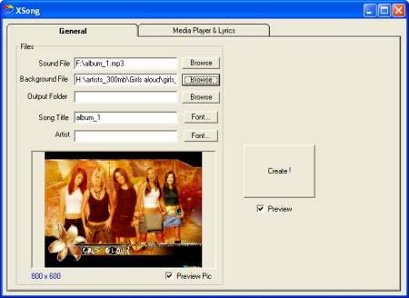

## HTML Song Creator

### Description

Combine a song (mp3 or wave or whatever) and lyrics and a background picture into a html page
 
### More Info
 

             |
---                |---
**Submitted On**   |2002-10-29 00:52:50
**By**             |[M\. J\. Highlander](https://github.com/Planet-Source-Code/PSCIndex/blob/master/ByAuthor/m-j-highlander.md)
**Level**          |Intermediate
**User Rating**    |4.8 (19 globes from 4 users)
**Compatibility**  |VB 6\.0
**Category**       |[Complete Applications](https://github.com/Planet-Source-Code/PSCIndex/blob/master/ByCategory/complete-applications__1-27.md)
**World**          |[Visual Basic](https://github.com/Planet-Source-Code/PSCIndex/blob/master/ByWorld/visual-basic.md)
**Archive File**   |[HTML\_Song\_1784638222004\.zip](https://github.com/Planet-Source-Code/m-j-highlander-html-song-creator__1-55745/archive/master.zip)

